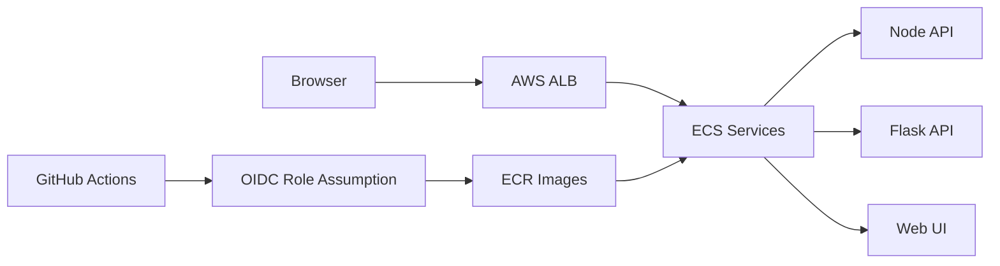

# Express Reliability Platform V3 — Orchestration + Identity Foundations

## Builds on V2

Before you start V3, copy your personal V2 repository to your local machine and rename it to V3:

```sh
git clone https://github.com/YOUR_USERNAME/express-reliability-platform-v02.git
mv express-reliability-platform-v02 express-reliability-platform-v03
cd express-reliability-platform-v03
```

Use the main class repository as your source for scripts and canonical project structure:

- https://github.com/Here2ServeU/express-reliability-platform-course

## 1) Version Purpose

Coordinate all services together locally, then introduce Terraform best practices before cloud deployment to ECS behind an Application Load Balancer.

---

## Plain Language Context

**What is this version teaching you?**
You will write code that tells Amazon's cloud to build servers, networks, and load balancers for you — automatically. Instead of logging into a website and clicking buttons, you write instructions in files. The cloud reads those files and builds exactly what you described.

**How does a bank or hospital use this?**
If a hospital's data center has a power failure, they need to rebuild their entire platform in a different location quickly. With Terraform, every server, network connection, and security rule is written in code files stored in GitHub. An engineer runs one command and the entire infrastructure is recreated in minutes — not days.

**Key terms in plain language:**

| Term | What It Means |
|---|---|
| **Terraform** | A tool that reads code files and builds cloud infrastructure — servers, networks, databases — automatically |
| **ECS (Elastic Container Service)** | Amazon's service for running Docker containers in the cloud |
| **ALB (Application Load Balancer)** | A service that distributes incoming web requests across multiple servers so no single server gets overwhelmed |
| **IAM (Identity and Access Management)** | AWS's system for controlling who and what is allowed to do what — like a security badge system |
| **OIDC** | A secure way for GitHub Actions to get temporary AWS credentials without storing any passwords |
| **Remote state** | Terraform saves a record of what it built in an S3 bucket, so the whole team shares the same understanding of what exists |
| **Modules** | Reusable blocks of Terraform code — like a function you can call multiple times with different inputs |
| **dev / staging / prod** | Three separate environments: dev is for testing, staging is a near-real rehearsal, prod is what real users see |

**Expected result at the end of this version:**
- `docker compose up --build` starts all three services locally.
- Terraform scripts deploy the platform to AWS ECS.
- The app is reachable via the load balancer URL.

---


## Training Workflow (Understand -> Build -> Test -> Break -> Fix -> Explain -> Automate -> Improve)

1. Understand: Read architecture, Terraform foundations, and deployment flow.
2. Build: Complete local Compose, Terraform, IAM/OIDC, and ECS steps in order.
3. Test: Validate endpoints, Terraform plan quality, and cloud health checks.
4. Break: Trigger one controlled failure (for example, stop one service/task).
5. Fix: Use logs, health checks, and cloud diagnostics to restore service.
6. Explain: Document what failed, why it failed, and what fixed it.
7. Automate: Add scripts/runbooks for repeatable deployment and recovery.
8. Improve: Re-run pipeline checks and tighten least-privilege/security controls.

## 3) What You Will Build

- A 3-service local stack with one command.
- Terraform foundations: modules, environments, variables, backend bootstrap, and remote state management.
- IAM/OIDC setup for secure CI/CD access.
- ECS deployment flow supported by scripts in `scripts/`.

## 3.1) Terraform Foundations (Start Here in V3)

Use these best practices from V3 onward:

1. Keep reusable logic in `modules/`.
2. Keep environment-specific roots in `environments/`.
3. Use `*.tfvars` for environment values, never hard-code account-specific values.
4. Bootstrap remote backend resources first (state bucket and lock table).
5. Store Terraform state remotely and isolate state per environment.
6. Promote changes in order: `dev -> staging -> prod`.

## 4) Architecture Diagram (Mermaid)



## 5) Project Structure

```text
express-reliability-platform-v03/
├── apps/
│   ├── node-api/
│   ├── flask-api/
│   └── web-ui/
├── docker-compose.yml
├── scripts/
│   ├── provision_iam_oidc.sh
│   ├── create_ecr_repos.sh
│   ├── build_tag_push_ecr.sh
│   ├── create_ecs_cluster_and_tasks.py
│   └── deploy_to_ecs.sh
└── README.md
```

## 6) Run Steps

### Part 1 — Local Compose (Mandatory Test Gate)

```sh
docker compose up --build
```

Endpoints:

- Node API: `http://localhost:3000`
- Flask API: `http://localhost:5000`
- Web UI: `http://localhost:8080`

Stop stack:

```sh
docker compose down
```

Do not move to cloud until local Compose checks pass.

### Part 2 — Terraform Workflow (Best Practice Pattern)

1. Bootstrap backend resources for remote state (one-time).
2. Initialize Terraform in your target environment.
3. Run `terraform fmt`, `terraform validate`, and `terraform plan`.
4. Apply in `dev` first, then promote unchanged plan pattern to `staging`, then `prod`.
5. Keep separate remote state keys/workspaces per environment.

### Part 3 — IAM + OIDC Foundation

1. Create AWS IAM users/groups with least privilege.
2. Configure GitHub OIDC trust for your repository.
3. Use `scripts/provision_iam_oidc.sh` as your bootstrap helper.

### Part 4 — ECS + ALB Deployment

Run scripts in order:

```sh
./scripts/create_ecr_repos.sh
./scripts/build_tag_push_ecr.sh
python3 scripts/create_ecs_cluster_and_tasks.py
./scripts/deploy_to_ecs.sh
```

## 7) Validation Checklist

- [ ] Compose starts all 3 services.
- [ ] Local endpoints return expected responses.
- [ ] Terraform validation and plan are clean in `dev`.
- [ ] Remote state backend is configured and lock protection works.
- [ ] ECR repositories are created.
- [ ] ECS services become healthy and reachable through ALB.
- [ ] OIDC-based deployment authentication works from CI/CD.

## 8) Troubleshooting

- Compose fails: run `docker compose logs` and fix the first service error.
- AWS auth errors: verify role trust policy and region configuration.
- ECS health check fails: confirm container port mappings and task definition.

## 9) Cleanup

- Local: `docker compose down`.
- Cloud: remove ECS services/tasks, ALB, and test ECR images when done.

## 10) Next Version Preview

In V4, you build on V3 by adding Prometheus + Grafana and begin reliability simulation through stress and failure scenarios, while keeping the same local Compose gate and cloud promotion flow.
