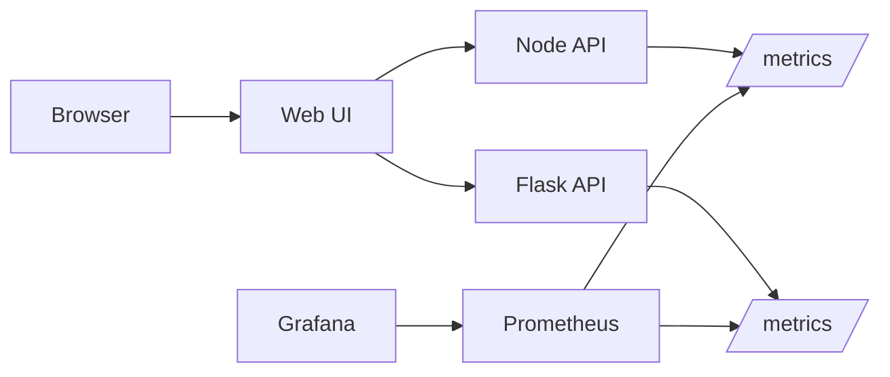

# Express Reliability Platform V4 — Observability + Real-World Simulation

## 1) Builds on V3

Before you start V4, copy your personal V3 repository to your local machine and rename it to V4:

```sh
git clone https://github.com/YOUR_USERNAME/express-reliability-platform-v03.git
mv express-reliability-platform-v03 express-reliability-platform-v04
cd express-reliability-platform-v04
```

Use the main class repository for scripts and canonical structure:

- https://github.com/Here2ServeU/express-reliability-platform-course

## 2) Version Purpose

Add observability to the platform and practice reliability engineering with controlled stress and failure scenarios. Run the full stack locally on Docker Compose, then deploy the application tier to AWS using Terraform.

---

## 3) Plain Language Context

**What is this version teaching you?**
You add a live dashboard to your platform so you can see exactly what is happening inside it at any moment — how fast it is responding, how many errors it is producing, and whether it is healthy. Without this, running a platform is like driving a car with no dashboard: you have no idea how fast you are going or when you are about to run out of fuel.

**How does a bank or hospital use this?**
Banks monitor transaction response times in real time. A sudden spike in latency can indicate fraud traffic, a server overload, or a network failure. A hospital monitoring platform tracks whether patient-record requests are succeeding. When a metric crosses a threshold, engineers get an alert immediately — not an hour later when users start calling.

**Key terms in plain language:**

| Term | What It Means |
|---|---|
| **Prometheus** | A program that collects numbers from your services every few seconds and stores them — like a health monitor taking readings continuously |
| **Metrics** | Numbers that describe how your system is performing — request rate, error rate, response time, memory usage |
| **Grafana** | A tool that draws metrics as charts and dashboards — like turning a spreadsheet of numbers into a visual graph |
| **SLI (Service Level Indicator)** | The actual measured value — for example, the real p95 response time right now |
| **SLO (Service Level Objective)** | The target you promise — for example, "p95 response time must stay under 500ms" |
| **p95 (95th percentile)** | The response time that 95% of requests are faster than — so if p95 is 400ms, 95 out of 100 requests finished in 400ms or less |
| **Alertmanager** | A tool connected to Prometheus that sends notifications when a metric crosses a threshold |
| **Load generation** | Sending many requests to your system to observe how it behaves under real traffic |
| **ECR** | AWS Elastic Container Registry — a private Docker registry that ECS pulls images from |
| **ECS Fargate** | AWS-managed container runtime — you give it a task definition and it runs the container without you managing any servers |
| **ALB** | Application Load Balancer — a public AWS endpoint that forwards HTTP traffic to your ECS tasks |

---


## 4) Training Workflow (Understand -> Build -> Test -> Break -> Fix -> Explain -> Automate -> Improve)

1. Understand: Read monitoring architecture and metric goals.
2. Build: Start the monitored stack locally and configure dashboards.
3. Test: Confirm targets are up and metrics change under load.
4. Break: Trigger a controlled fault or stress event.
5. Fix: Use metrics, logs, and alerts to recover.
6. Explain: Document what failed, why it failed, and what fixed it.
7. Automate: Add repeatable stress tests and alert checks.
8. Improve: Tune SLI/SLO thresholds and alert quality.

## 5) What You Will Build

- A monitored stack with service metrics in Prometheus.
- Dashboards in Grafana for reliability visibility.
- A repeatable method to test latency/error behavior.

## 6) Why Terraform Is Included in V4

Terraform is infrastructure-as-code (IaC): you define infrastructure in versioned files instead of creating it manually in a cloud console.

- **Locally (Docker Compose):** the full stack — three application services, Prometheus, Grafana — with a working dashboard.
- **On AWS (Terraform):** the application tier deployed to ECS Fargate behind an ALB, with images stored in ECR and Terraform state stored in S3 with DynamoDB locking.
- A repeatable method to validate latency and error behavior in both environments.

> **Scope note:** V4 deploys the **application tier** to AWS (web-ui, node-api, flask-api). Prometheus and Grafana stay local in V4 — they move to AWS in V5 (Kubernetes/EKS), which is the right place for managed observability.

## 6) Architecture Diagrams

## 7) Architecture Diagram (Mermaid)



## 8) Project Structure

```text
express-reliability-platform-v04/
├── apps/
│   ├── flask-api/
│   ├── node-api/
│   └── web-ui/
├── monitoring/
│   ├── prometheus.yml
│   ├── alert.rules.yml
│   └── grafana-dashboard.json
├── docker-compose.yml
├── scripts/
│   ├── cleanup_v4.sh
│   └── tf_deploy.sh
├── terraform/
│   ├── bootstrap/         # S3 state bucket + DynamoDB lock table
│   │   └── main.tf
│   └── platform/          # ECR + VPC + ECS Fargate + ALB + IAM
│       ├── alb.tf
│       ├── backend.tf
│       ├── ecr.tf
│       ├── ecs.tf
│       ├── iam.tf
│       ├── networking.tf
│       └── variables.tf
└── README.md
```

## 9) Run Steps

1. Start the stack:

   ```sh
   docker compose up --build
   ```

2. Open the endpoints:
   - App UI: `http://localhost:8080`
   - Node API: `http://localhost:3000`
   - Flask API: `http://localhost:5050`
   - Prometheus: `http://localhost:9090`
   - Grafana: `http://localhost:3000`

   > **Note on port 5050:** macOS uses port 5000 for AirPlay Receiver, so the Flask API is mapped to host port `5050` in `docker-compose.yml`. Inside the Docker network, services still reach Flask on port `5000` via the service name `flask-api:5000`.

3. Generate load with any HTTP tool (`hey`, `ab`, or browser refresh loops).

4. Log in to Grafana — see [Section 9](#9-grafana-first-time-login).

5. Import the starter dashboard — see [Section 10](#10-import-the-starter-dashboard).

6. Observe latency, request count, and error trends in Grafana.

## 9) Grafana First-Time Login

The first time you open Grafana at `http://localhost:3001`, it will ask you to sign in.

1. Sign in with the default credentials:
   - **Username:** `admin`
   - **Password:** `admin`

2. Grafana will immediately prompt you to **set a new password**.
   - For local learning environments, you can set anything memorable (for example, `admin123`).
   - For any shared or non-local environment, choose a strong password — the default `admin/admin` is the most common attack target on exposed Grafana instances.

3. After setting the new password, you land on the Grafana home page. You are now ready to add a datasource and import the dashboard.

> **Forgot the password you set?** Reset it inside the running Grafana container:
>
> ```sh
> docker compose exec grafana grafana-cli admin reset-admin-password admin
> ```
>
> Or wipe Grafana state entirely with `docker compose down -v` (this also deletes saved dashboards).

## 10) Import the Starter Dashboard

Use `monitoring/grafana-dashboard.json` as a prebuilt dashboard template so you do not have to create panels manually.

1. Confirm Prometheus is collecting targets:
   - Open `http://localhost:9090/targets`.
   - Verify `node-api` and `flask-api` are `UP`.

2. Add Prometheus as a Grafana datasource:
   - In Grafana, go to **Connections -> Data sources -> Add data source**.
   - Choose **Prometheus**.
   - Set URL to `http://prometheus:9090` (this is the in-network address — Grafana reaches Prometheus by service name, not `localhost`).
   - Click **Save & test**. You should see "Successfully queried the Prometheus API".

3. Import the dashboard JSON. You have two ways to do this — pick whichever works for you:

   **Option A — Upload the file:**
   - Go to **Dashboards -> New -> Import**.
   - Click **Upload dashboard JSON file** and select `monitoring/grafana-dashboard.json`.
   - On the import screen, map `DS_PROMETHEUS` to the Prometheus datasource you just created.
   - Click **Import**.

   **Option B — Copy and paste the JSON:**
   - Open `monitoring/grafana-dashboard.json` in your editor and copy the entire contents.
   - In Grafana, go to **Dashboards -> New -> Import**.
   - Paste the JSON into the **Import via panel json** text box.
   - Click **Load**.
   - Map `DS_PROMETHEUS` to your Prometheus datasource and click **Import**.

4. Fix any panels that say "No data" (datasource not bound):

   After import, individual panels can still be tied to the wrong datasource UID. Re-bind them one of two ways:

   **Per-panel fix (recommended for one or two panels):**
   - On the panel that shows "No data", click the **three dots (⋮)** next to the panel title.
   - Choose **Edit**.
   - At the bottom of the edit screen, find the **Data source** dropdown and select your **Prometheus** datasource.
   - Click **Apply** (top right) and then **Save dashboard**.

   **Bulk fix (faster if many panels are broken):**
   - Click the **three dots (⋮)** at the top right of the dashboard.
   - Choose **Settings -> JSON Model**.
   - In the JSON, replace any `"datasource": { "uid": "..." }` blocks with `"datasource": "Prometheus"` (or paste the corrected JSON from `monitoring/grafana-dashboard.json`).
   - Click **Save changes**, then **Save dashboard**.

5. Validate the dashboard is working:
   - Hit `http://localhost:3000/` and `http://localhost:5050/` several times to generate traffic.
   - In Grafana, confirm panels show non-empty series (availability, Flask request rate, and process memory).

6. If panels are still blank after re-binding the datasource, check these:
   - Time range is too narrow: set the dashboard range to `Last 15 minutes`.
   - Datasource mapping issue: re-import and confirm `DS_PROMETHEUS` is mapped correctly.
   - No traffic yet: hit the API endpoints again to produce fresh metrics.

## 10) Validation Checklist

- [ ] Compose launches all app and monitoring services (`docker compose ps` shows them all `running` or `healthy`).
- [ ] Prometheus targets at `http://localhost:9090/targets` show app services as `UP`.
- [ ] Grafana login works and the password has been changed from the default.
- [ ] Grafana can query the Prometheus datasource (Save & test succeeded).
- [ ] Dashboard panels show non-empty series after generating load.

## 11) Troubleshooting

- **Port 5000 already in use** on macOS: that's AirPlay Receiver. Either disable it (System Settings -> General -> AirDrop & Handoff -> turn off **AirPlay Receiver**) or keep the `5050:5000` mapping already in `docker-compose.yml`.
- **Prometheus target down:** verify the service name and port in `monitoring/prometheus.yml` match the container names in `docker-compose.yml`.
- **Grafana empty dashboards:** confirm the Prometheus datasource URL is `http://prometheus:9090`, not `http://localhost:9090`.
- **Grafana login keeps failing:** reset with `docker compose exec grafana grafana-cli admin reset-admin-password admin`, or wipe state with `docker compose down -v`.
- **Container restart loops:** inspect logs with `docker compose logs <service>`.

## 12) Cleanup

```sh
docker compose down
```

Add `-v` (`docker compose down -v`) to also delete volumes — useful for resetting Grafana to a clean state.

---

# Part B — Deploy and Validate on AWS (Terraform)

## 14) AWS Prerequisites and Stack Overview

**Prerequisites:**
- AWS CLI v2 configured (`aws configure`) with credentials that can create VPC, ECS, ALB, IAM, ECR, S3, and DynamoDB resources.
- Terraform ≥ 1.5.
- Docker running locally (used to build images before pushing to ECR).

## 13) Next Version Preview

In V5, you build on V4 by moving to Kubernetes on EKS and adding self-healing and autoscaling concepts.

---

## 14) Web UI Guide — `apps/web-ui/index.html`

### Platform Continuity

The V4 UI keeps the same V2 regulated readiness console and evolves it with observability checks. Students should experience this as the same platform growing, not as a separate app.

### What the V4 UI Does

The V4 `index.html` is the operational visibility console. It explains and scores whether the platform has enough observability to support regulated fintech or healthcare operations.

The page focuses on:

- Reliability signals from health checks and latency posture.
- Cost visibility through dashboard-driven utilization review.
- Security and compliance evidence through captured metrics and screenshots.
- Intelligence readiness by building the telemetry foundation needed for AIOps.

It also includes local operations links for:

- Node API: `http://localhost:3000`
- Flask API: `http://localhost:5000`
- Prometheus: `http://localhost:9090`
- Grafana: `http://localhost:3001`

### What It Is Used For

Use the V4 UI to show students why observability is required before a platform can be trusted. A bank or hospital must be able to answer basic questions quickly: Is the service up? Is latency rising? Are dashboards populated? Do we have evidence for an audit or incident review?

This UI is useful for:

- Demonstrating the connection between application health and monitoring tools.
- Guiding students through Prometheus and Grafana validation.
- Creating screenshots for evidence packs.
- Preparing for V5 Kubernetes reliability controls.

### How to Read the Results

The JSON output describes observability readiness.

| Field | Meaning |
|---|---|
| `readiness_score` | Overall observability readiness score from 0 to 100. |
| `readiness_band` | Plain-language status of the platform. |
| `domains.reliability` | Impacted by dashboard availability and latency posture. |
| `domains.cost_efficiency` | Improves when dashboards provide utilization visibility. |
| `domains.security_compliance` | Improves when screenshots and metric evidence are captured. |
| `domains.intelligence_aiops_mlops` | Shows whether telemetry is strong enough for later AIOps work. |

If dashboards are missing or latency is above target, expect reliability and intelligence scores to drop. If evidence is missing, expect the security/compliance score to drop.